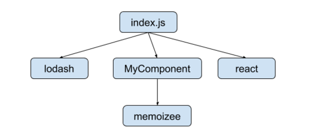

# 核心概念

webpack 用於現代模組 JavaScript 程式的打包工具。從入口進入產生依賴關係圖，透過各式各樣的 loader 處理之後輸出檔案

## Entry

webpack 會從 Entry 進入，開始分析並畫出依賴關係圖



```javascript
// webpack.config.js
module.exports = {
  entry: './path/to/my/entry/index.js'
};
```

## Output

告訴 webpack 輸出的檔案要放在哪，要如何命名

```javascript
// webpack.config.js
const path = require("path");

module.exports = {
  // ...
  output: {
    filename: "main.js",
    path: path.resolve(__dirname, "dist"),
  }  
}
```

## Loader

webpack 預設只能讀取 JavaScript 和 JSON 兩種格式的檔案，如果需要讀取其他格式的檔案需要加上 loader，例如 CSS

```javascript
// webpack.config.js
const path = require("path");

module.exports = {
  // ...
  module: {
    rules: [
      { test: /\.css$/, use: ["style-loader", "css-loader"] },
    ],
  },
}
```

## Plugin

Plugin 可以做到打包最佳化、資源管理、資源注入

```javascript
// webpack.config.js
const HtmlWebpackPlugin = require('html-webpack-plugin');

module.exports = {
  // ...
  plugins: [
    new HtmlWebpackPlugin({ template: './src/index.html' })
  ]
}
```

webpack 官方有出一系列的 [plugin 列表](https://webpack.js.org/plugins/)

## Mode

webpack 可以針對不同環境做客製化

```javascript
// webpack.config.js
module.exports = {
  mode: 'production'
}
```
